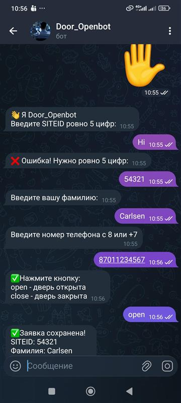
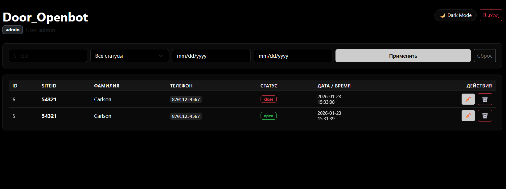
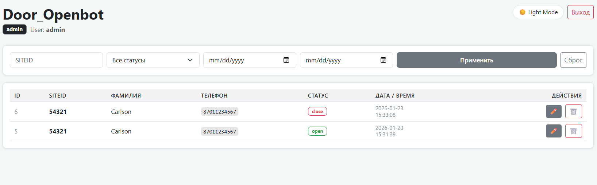

🤖 Door_Openbot & Monitoring Dashboard
​A comprehensive hybrid system for registering and managing facility access requests. It features a Telegram Bot for field personnel and a Web Dashboard for administrators and users.

🌟 Key Features
📱 Telegram Bot

Telegram Bot (aiogram 3.x)
​FSM Registration: Step-by-step data collection (SITEID, Surname, Phone).
​Validation: Strict validation for SITEID (exactly 5 digits) and phone formats (+7/8).
​Interactive UI: Custom Reply Keyboards for instant status updates (open/close).
​Async Core: Non-blocking database operations using aiosqlite.

​Web Dashboard (FastAPI)
​Auth System: Role-based access control (admin vs user) with secure session management.

Data Management:
​user: Can only view their own records (filtered by surname).
​admin: Full CRUD capabilities (Create, Read, Update, Delete).

​Advanced Filtering: Search by Site ID, Status, and Date Range.
​Reporting: Export data to CSV and Excel (XLSX) formats using Pandas.

### 📸 screenshots

#### Telegram Bot

#### Admin Panel

💻 Web Admin Dashboard
Authentication: Secure session-based login with role-based access control (RBAC).

Role Model:

admin: Full access — view, edit, delete records, and export data.

user: Restricted access — can only view records matching their own surname.

Advanced Filtering: Search and sort by SITEID, status, and date ranges.

Data Export: Instant download of the entire database in CSV and Excel (.xlsx) formats.

🛠 Tech Stack
Backend: Python 3.12, FastAPI, Uvicorn.

Telegram: Aiogram 3.x.

Database: SQLite (via aiosqlite).

Data Processing: Pandas, Openpyxl (for Excel generation).

Frontend: Jinja2 Templates, HTML/CSS.

Security: bcrypt (password hashing), Starlette SessionMiddleware.

Deployment: Docker & Docker Compose.

​📋 Project Structure
├── main.py              # Application Entry Point (Bot + FastAPI)
├── database.py          # Database Schema & Async CRUD Logic
├── templates/           # HTML Templates (Login, Dashboard)
├── .env                 # Environment Variables (Sensitive Data)
├── requirements.txt     # Dependency List
├── Dockerfile           # Containerization Configuration
└── data/                # Database Storage Directory

🚀 Quick Start
​1. Manual Setup

Clone the repository:
git clone https://github.com/kanakush/chatbot-web-app.git
cd door-open-bot

Configure Environment:
Create a .env file in the root directory:

pip install -r requirements.txt

Run the Application:
python main.py

Docker Deployment (Recommended)
This project is containerized for easy deployment.

Build the image:
docker build -t door-bot-system .

Run the container:
docker run -d -p 8000:8000 --env-file .env --name door-bot-app door-bot-system

🔒 Security & Best Practices
Password Hashing: Uses secure verification logic to prevent plain-text credential leaks.
Session Middleware: Implements encrypted client-side sessions for user tracking.
Input Sanitization: Regex-based validation for all user inputs in the bot interface.
Graceful Shutdown: Properly cancels background bot tasks when the server stops.

📄 License
This project is licensed under the terms of the GPLv3 License. See the LICENSE file for details.
Suggested Dockerfile (Save this as Dockerfile in your root):

FROM python:3.10-slim

WORKDIR /app

COPY requirements.txt .
RUN pip install --no-cache-dir -r requirements.txt

COPY . .

# Create directory for DB
RUN mkdir -p data

EXPOSE 8000

CMD ["python", "main.py"]

