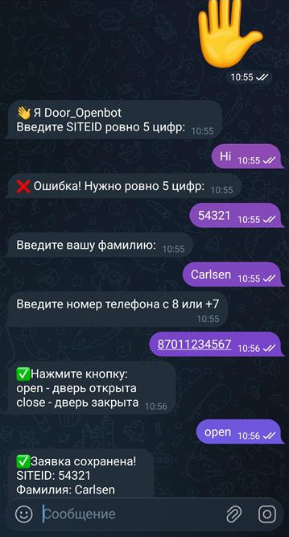
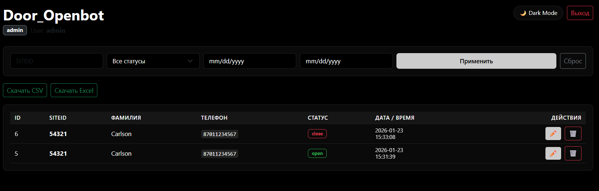
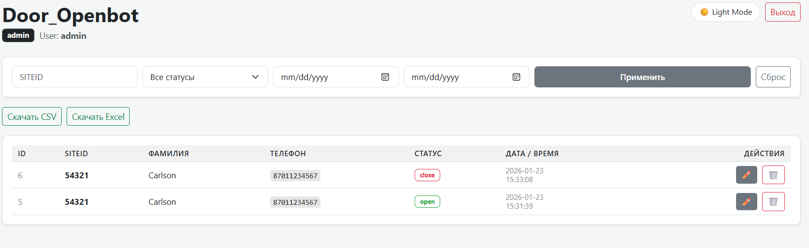

🤖 Door_Openbot & Monitoring Dashboard
​A comprehensive hybrid system for registering and managing facility access requests. It features a Telegram Bot for field personnel and a Web Dashboard for administrators and users.

🌟 Key Features
📱 Telegram Bot

Telegram Bot (aiogram 3.x)
​FSM Registration: Step-by-step data collection (SITEID, Surname, Phone).
​Validation: Strict validation for SITEID (exactly 5 digits) and phone formats (+7/8).
​Interactive UI: Custom Reply Keyboards for instant status updates (open/close).
​Async Core: Non-blocking database operations using aiosqlite.

### 📸 screenshots

#### Telegram Bot

💻 Web Admin Dashboard

Authentication: Secure session-based login with role-based access control (RBAC).

Role Model:

admin: Full access — view, edit, delete records, and export data.

user: Restricted access — can only view records matching their own surname.

Advanced Filtering: Search and sort by SITEID, status, and date ranges.

Data Export: Instant download of the entire database in CSV and Excel (.xlsx) formats.

#### Admin Panel
#Dark mode

#Light mode

🛠 Tech Stack
Backend: Python 3.12, FastAPI, Uvicorn.

Telegram: Aiogram 3.x.

Database: SQLite (via aiosqlite).

Data Processing: Pandas, Openpyxl (for Excel generation).

Frontend: Jinja2 Templates, HTML/CSS.

Security: bcrypt (password hashing), Starlette SessionMiddleware.

🔒 Security & Best Practices
Password Hashing: Secure verification logic prevents plain-text credential storage in the database.
Session Middleware: Encrypted client-side sessions for secure user tracking.
Input Sanitization: Strict Regex-based validation for all Telegram Bot inputs (Site ID, Phone).
Graceful Shutdown: The system properly handles signals to cancel background bot tasks and close DB connections cleanly.

📄 License
This project is licensed under the terms of the GPLv3 License. See the LICENSE file for details.

​🐳 Deployment with Docker
​This project is fully containerized. Docker ensures the application runs consistently regardless of the host OS, managing the Telegram Bot, FastAPI Dashboard, and SQLite Database in a single ecosystem.
​1. Prerequisites
​Docker and Docker Compose installed.
​A .env file containing your BOT_TOKEN and SECRET_KEY.
​2. Configuration Highlights
​Port Mapping: The internal FastAPI port 8000 is mapped to port 80 on your host. Access the dashboard via http://your-server-ip/ or http://localhost/.
​Data Persistence: The SQLite database is mounted as a host volume (./data.db). Your data remains safe even if the container is deleted or updated.
​Restart Policy: Configured to always, ensuring the bot automatically recovers from server reboots or unexpected crashes.

​🚀 Quick Start
​The easiest way to deploy the system is using Docker Compose:

1. Clone the repository:
git clone https://github.com/kanakush/chatbot-web-app.git
cd chatbot-web-app

2. Configure Environment:
Create a .env file in the root directory:
BOT_TOKEN=your_telegram_bot_token
SECRET_KEY=your_secure_session_key

3. Launch:
docker-compose up -d --build
The Web Dashboard will be live at http://localhost.

Task Command
View Logs docker logs -f chatbot_system
Stop System docker-compose down
Restart/Apply Changes docker-compose up -d --build
Check Container Status docker ps

📋 Project Structure

chatbot-web-app
├── main.py            
├── database.py
├── .gitignore
├── screenshots/
├── templates/  
    └── dashboard.html
    └── login.html
├── .env               
├── requirements.txt     
├── Dockerfile  
├── docker-compose.yml
├── data.db   
├── LICENSE
├── README.md
├── Project Structure